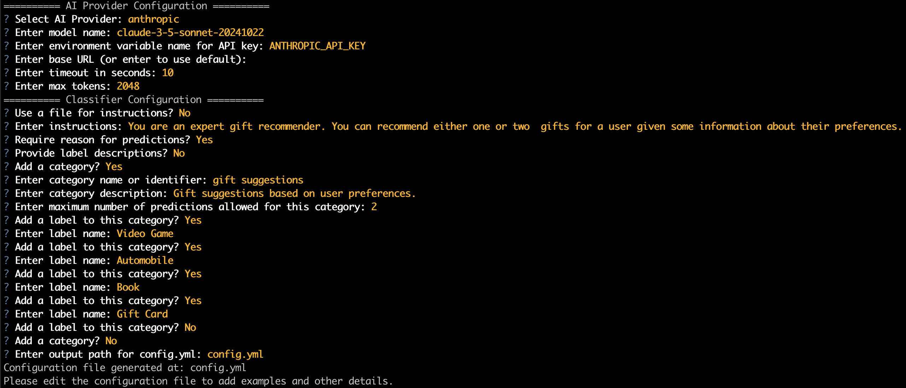

# Tutorial

[Source Code](https://github.com/am1tyadav/cosmonaut/tree/main/examples/multi_label)

In this example, we'll explore a multi-label classification problem where each input can be assigned multiple labels from a single category. Specifically, we'll build a gift recommendation system that suggests one or more appropriate gifts (labels) based on a user's description of their interests.

Let's start by installing Cosmonaut:

```bash
# Create a new virtual environment
python -m venv venv
source venv/bin/activate

python -m pip install cosmonaut
```

## Describe the classification problem

Cosmonaut expects the classification problem to be _described_ in a configuration file. Additionally, this config file is used to configure the AI provider that is used to perform the classification.

In order to create the configuration file, we will use the CLI:

```bash
cosmonaut-config
```

This will kick off a questionnaire to help you create the configuration file for the Cosmonaut classifier. As an example, here's a screenshot of the values that I've provided:



This will generate a `config.yml` file that may need to be edited further if you want to provide some examples to the model for the classification task. It's usually a good idea to add a few examples - especially if you have some edge cases. After adding the examples, my `config.yml` looks like this:

```yaml
classifier:
  instructions_filename: null
  instructions:
    You are an expert gift recommender. You can recommend either one or
    two  gifts for a user given some information about their preferences.
  require_reason: true # Model will give a reason for each predicted label
  label_descriptions_provided: false
  categories:
    - category: gift suggestions
      description: Gift suggestions based on user preferences.
      max_predictions: 2 # 1 or 2 predictions for each input
      labels:
        - Video Game
        - Automobile
        - Book
        - Gift Card
  examples:
    - predictions:
        - category: gift suggestions
          labels:
            - label: Video Game
              reason: The user is interested in video games.
            - label: Gift Card
              reason: The user likes to use gift cards to buy video games online.
    - predictions:
        - category: gift suggestions
          labels:
            - label: Book
              reason: The user specifically mentions that they like to read books.

ai_client:
  ai_provider: anthropic
  name: claude-3-5-sonnet-20241022
  api_key_var: ANTHROPIC_API_KEY # The environment variable that will hold the API KEY
  base_url: null
  timeout: 10
  max_tokens: 2048
  openai_response_format: text # This is not be relevant for non-OpenAI models

data:
  result_column: result
```

## Create a prompt function

While the system prompt is populated automatically when we instantiate a `Cosmonaut` object, we need to create a prompt function that will be used to create the prompt for each input. This prompt function will be passed to the `Cosmonaut` object when it is instantiated.

Let's create a python script called `main.py`. For this example, we will create a straightforward prompt function:

```python
import pandas as pd

def create_prompt(inputs: pd.Series) -> str:
    text = inputs["text"]
    return f"Please suggest one or two gifts for the following user: {text}"
```

The inputs DataFrame is expected to have a `text` column with the information on user preferences. The `create_prompt` function can often be more complicated in real-life use cases where multiple columns may need to be combined to create the inputs to the model.

## Create some inputs

For this example, we will create a couple of inputs in a pandas DataFrame. Continuing from the previous `main.py` script:

```python
import pandas as pd

def create_prompt(inputs: pd.Series) -> str:
    text = inputs["text"]
    return f"Please suggest one or two gifts for the following user: {text}"

inputs = pd.DataFrame(
    {
        "text": [
            "I likes to play video games. I buy them online often with gift cards that I get on my birthday.",
            "I dont really do online shopping but I do like cars",
        ]
    }
)
```

## Create a Cosmonaut classifier

Now we are ready to create the classifier, and get our predictions. We will need to pass the path to the previously created `config.yml` file as well as the prompt creation function to Cosmonaut:

```python
from pathlib import Path
import pandas as pd
from cosmonaut import Cosmonaut

def create_prompt(inputs: pd.Series) -> str:
    text = inputs["text"]
    return f"Please suggest one or two gifts for the following user: {text}"

inputs = pd.DataFrame(
    {
        "text": [
            "I likes to play video games. I buy them online often with gift cards that I get on my birthday.",
            "I dont really do online shopping but I do like cars",
        ]
    }
)

config_filepath = Path(__file__).parent / "config.yml"

classifier = Cosmonaut(config_filepath, create_prompt)
response_df = classifier.run(inputs)

print(response_df.head())
```

You can expect to see something like the following output for each of the inputs:

```json
{
  "success": true,
  "info": "success",
  "detail": null,
  "predictions": {
    "predictions": [
      {
        "category": "gift suggestions",
        "labels": [
          {
            "label": "Video Game",
            "reason": "The user explicitly states they enjoy playing video games and plays them frequently"
          },
          {
            "label": "Gift Card",
            "reason": "The user mentions they regularly use gift cards to purchase video games online"
          }
        ]
      }
    ]
  }
}
```

While the results are recorded as a JSON object in the result column, this schema is fixed for this classifier, so you can extract or flatten the values as needed in your final table.

If you want to re-use this classifier, simply using the `config.yml` in a new script would suffice. Alternatively, you can save the entire config data that's internally created and used with `classifier.save_config` method. For example, in this instance, we can add the line `classifier.save_config("config.json")` at the end of the script. This config can be loaded as a python dictionary and then passed in a Cosmonaut class when instantiating. For example:

```python
config_dict = {...}

classifier = Cosmonaut(config_dict, create_prompt)
```
